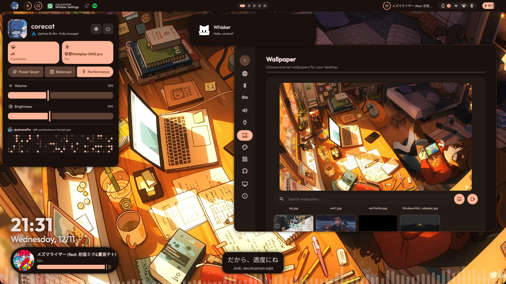
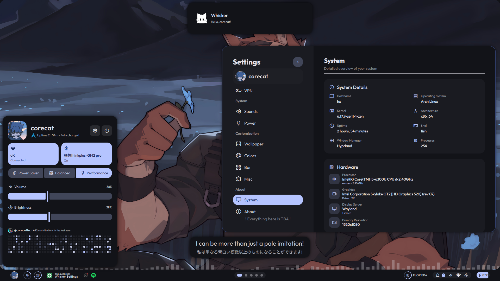
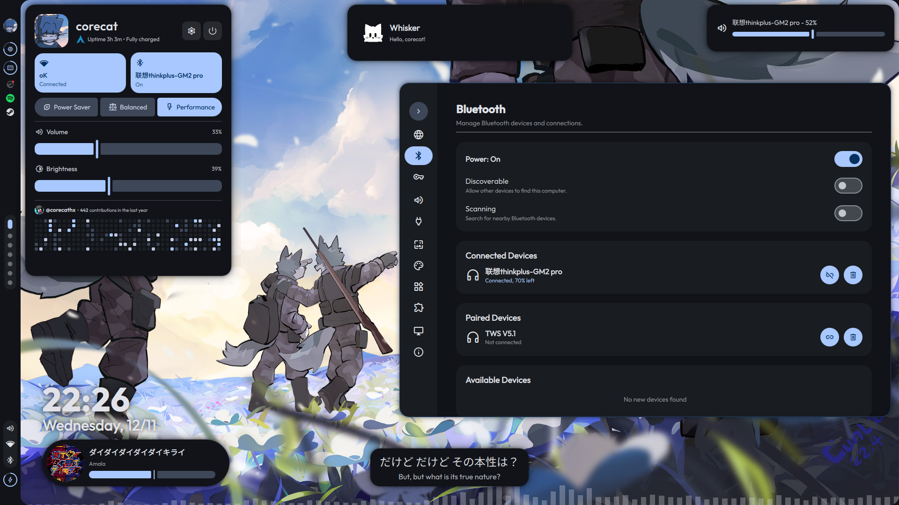
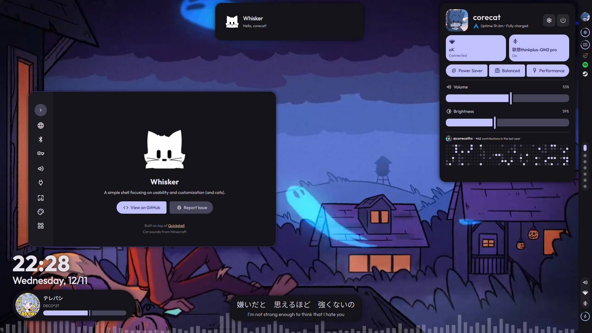

<div align="center">
    
    
</div>

<h2></h2>
<div align="center">

<br>


</div>
<p align="center">
  A simple shell for <b><a href="https://hyprland.org"> Hyprland</a></b>, focusing on usability and customization (and cats).<br>
  Built on top of <b><a href="https://quickshell.org"> Quickshell</a></b>.
</p>

<div align="center">
    <h2>✦ Information ✦</h2>
</div>

**Whisker** is already usable now, but everything is still subject to change over time.

**Whisker** is available on Arch Linux's User Repository (AUR)!
Simply run
```bash
yay -S whisker-shell-git
```
... or with any other AUR helpers to get your hands on this shell :]

Also I'm still a Quickshell newbie, so most code in here might look messy / unorganized :')
<div align="center">
  <h2>✦ Previews ✦</h2>
</div>

<table align="center">
  <tbody>
    <tr>
      <td align="center">
        <br>
        <b>Default Layout (Top Bar)</b>
      </td>
      <td align="center">
        <br>
        <b>Alternative Layout (Bottom Bar)</b>
      </td>
    </tr>
    <tr>
      <td colspan="2" align="center">
        <br>
        These left and right bar modes are still experimental!
        <br><br>
      </td>
    </tr>
    <tr>
      <td align="center">
        <br>
        <b>Left Bar Layout (Experimental)</b>
      </td>
      <td align="center">
        <br>
        <b>Right Bar Layout (Experimental)</b>
      </td>
    </tr>
  </tbody>
</table>

<div align="center">
    <h2>✦ Related Projects ✦</h2>
</div>

### ✦ whisker-cli

`whisker-cli` is a small helper program for my Hyprland Shell, **Whisker**.

> https://github.com/corecathx/whisker-cli

<div align="center">
    <h2>✦ Credits ✦</h2>
</div>

This shell is **heavily** inspired by  
- **[caelestia-shell](https://github.com/caelestia-dots/shell)** by [soramanew](https://github.com/soramanew)  
- **[illogical-impulse](https://github.com/end-4/illogical-impulse)** by [end-4](https://github.com/end-4).

Big thanks to the **Quickshell** community with all the help they provided when I'm developing this shell <3

<div align="center">
    <h2>✦ Motivational Cat ✦</h2>
</div>


<div align='center'>


</div>
