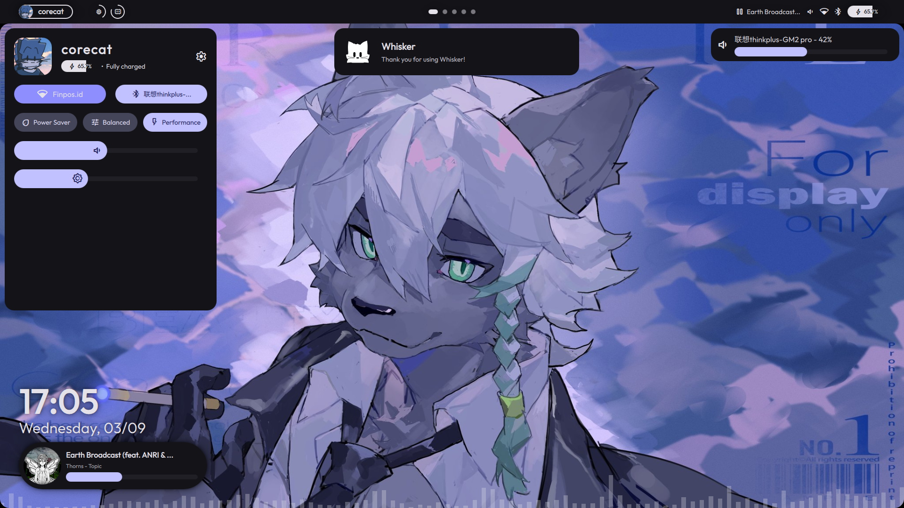

<p align="center">
  
</p>
<h2 align="center">✦ ◇&nbsp; Whisker &nbsp;◇ ✦</h2>
<div align="center">


</div>
<p align="center">
  A simple shell for <b><a href="https://hyprland.org"> Hyprland</a></b>, focusing on usability and customization (and cats).<br>
  Built on top of <b><a href="https://quickshell.org"> Quickshell</a></b>.
</p>

## Under Development
**Whisker** is already usable now, but everything is still subject to change over time.

**Whisker** is available on Arch Linux's User Repository (AUR)!
Simply run
```bash
yay -S whisker-shell-git
```
... or with any other AUR helpers to get your hands on this shell :]

Also I'm still a Quickshell newbie, so most code in here might look messy / unorganized :')

## Previews
| <p align="center"> Default Layout (Top Bar) </p> | <p align="center"> Alternative Layout (Bottom Bar) </p>  |
|--------------------------|--------------------------------|
| <p align="center"></p> | <p align="center"></p> |
| **Whisker**'s default layout. | Perfect for our Windows friends ;) |

## Motivational Cat
Behold, the vibing cat.

