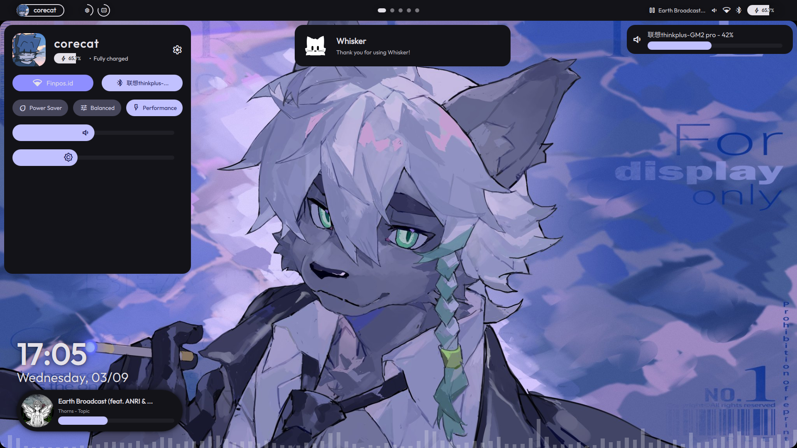
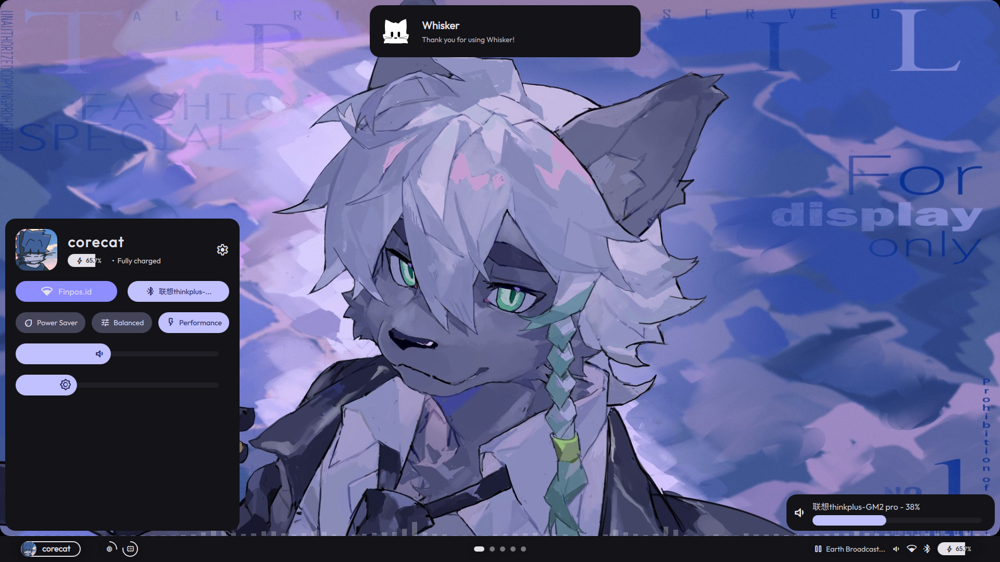

<p align="center">
  
</p>

<h2 align="center">Whisker</h2>

<p align="center">
  A simple shell for <a href="https://hyprland.org">Hyprland</a>, focused on usability.<br>
  Built on top of <a href="https://quickshell.org">Quickshell</a>.
</p>

> This shell works "perfectly" with CoreCat's Dotfiles.

## 🚧 Under Development

**Whisker** is already usable now, but everything is still subject to change overtime.

**Whisker** is available on Arch Linux's AUR Repository!
Simply run 
```bash
yay -S whisker-shell-git
```
... or with any other AUR helpers to get your hands on this shell :]


Also I'm still a Quickshell newbie, so most code in here might look messy / unorganized :')


## Previews

| <p align="center"> Default Layout (Top Bar) </p> | <p align="center"> Alternative Layout (Bottom Bar) </p>  |
|--------------------------|--------------------------------|
| <p align="center"></p> | <p align="center"></p> |
| **Whisker**'s default layout. | Perfect for our Windows friends ;) |

## Motivational Cat Gif
Behold, the vibing cat.  

