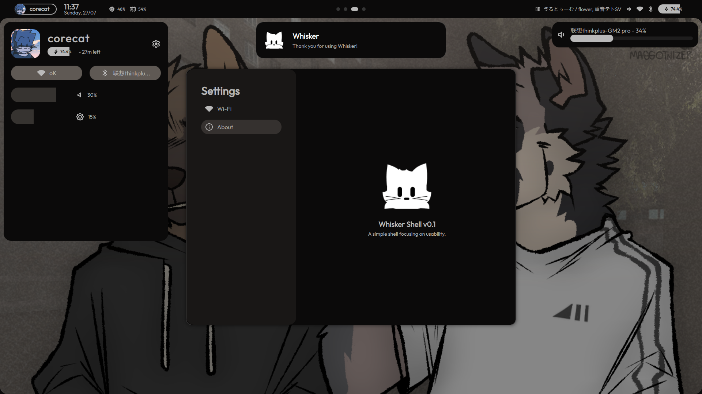
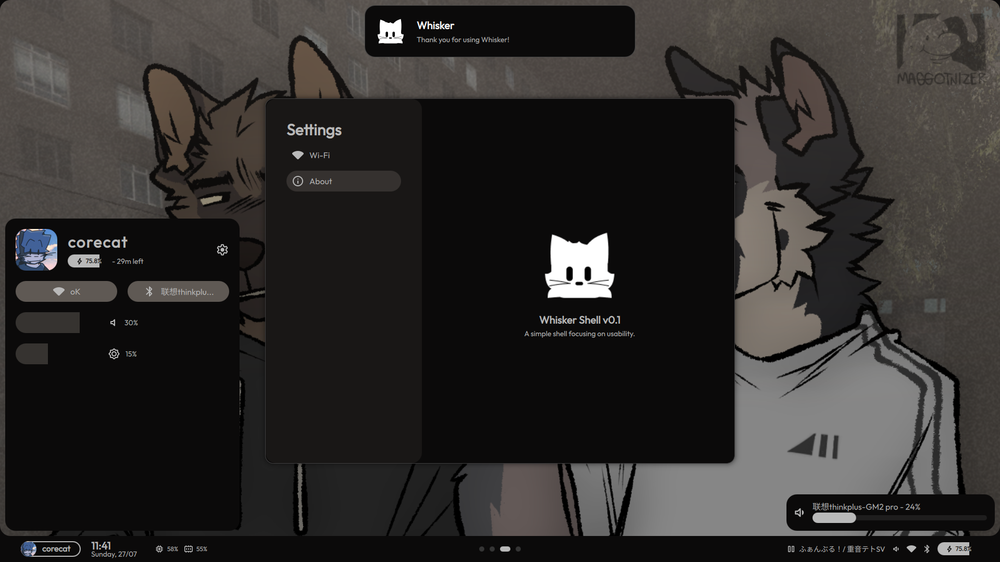

  

<h2 align="center">Whisker</h2>

  A simple shell for <a href="https://hyprland.org">Hyprland</a>, focused on usability. 
  Built on top of <a href="https://quickshell.org">Quickshell</a>.

> This shell works "perfectly" with CoreCat's Dotfiles.

## 🚧 Under Development

**Whisker** is already usable now, but everything is still subject to change overtime.

Also I'm still a Quickshell newbie, so most code in here might look messy / unorganized :')

## Previews
This is **Whisker**'s default layout:

**Whisker** also supports layouts like this! (mainly for our Windows friends ;))  

## Motivational Cat Gif
Behold, the vibing cat.  

